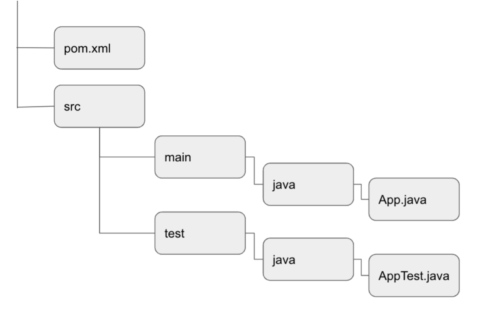

## What is maven and why use it?

Maven is an open-source build automation tool developed by the Apache software foundation. The tool allows developers to build and document the lifecycle framework. Maven includes features to compile source code, run tests, package your results and upload these packages to remote repos. It is widely used to manage project dependencies and the whole lifecycle of any project.

The project structure of a Java project in Maven generally looks like this: 

To test in Maven you can add your tests to the files in the “test”-folder. An example of this is that the tests for the class src/main/java/App.java are located in src/test/java/AppTest.java

Maven provides pom.xml which is the core of any project. This is the configuration file containing project information and configuration details used by Maven build. It is located in the root directory of each project. 